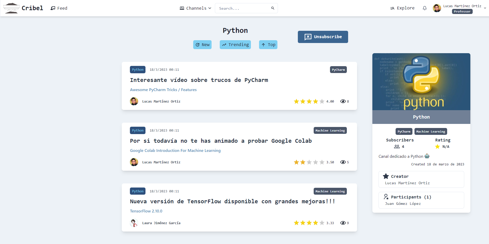

# **CRIBEL** LifeLong Learning platform
Cribel is a social network aimed at the continuous learning of users. Here you can find recommendations of quality content to learn about any subject. These recommendations are made by experts in the field, teachers or technicians in the sector. You can be sure that they have done a good content filtering!
<br/>



<br/>

## In this social network you will be able to: 
**Consult expert channels**
You can consult the channels of experts on the topic you are interested in. And sort them by new, popularity or best rating

**Explore the best channels or posts**
You will be able to browse through all the existing channels or posts on the platform.

**Rate posts**
Your ratings are very important for other users. Don't forget to rate the posts you see.

**Subscribe to channels**
By subscribing to a channel you will be kept up to date with the latest posts.

**Create channels**
You can create channels dedicated to a specific topic of your choice. And start posting!

**Add participants to your channels**
Add other users to your channels so they can collaborate with you.

<br/>

## How to clone this project

### Prerequisites
To run this application, you will need the following:

- An AWS account
- An instance of Amplify CLI installed on your local machine. You can install it by following these instructions: https://docs.amplify.aws/cli/start/install
- Node.js and npm installed on your local machine. You can download them here: https://nodejs.org/en/download/


Clone the Github repository:

```sh
git clone https://github.com/ivosth/amplifyapp.git
cd amplifyapp
```

Initialise the Amplify CLI instance

```sh
npm install
```

Init Amplify project:

```sh
amplify init
```

Deploy the Amplify configuration and create the required resources on AWS:

```sh
amplify push
```

Start the project on local:

```sh
npm start
```

### Post-requisites
To fill the application with data:
Go to the deployment folder

```sh
cd deployment
```

Edit the createContent file modifying the variables, user_pool_id, client_id, bucket_name, identity_pool_id, account_id and api_appsync_url with the ARNs of your already deployed resources (you can use the commented command to get this information).
Once edited run it:

```sh
python createContent.py
```

Once the application is filled with data, you will be able to log in with any user from the following list:
- As Student:
  - User: student1@gmail.com Password: student1@gmail.com
  - User: student2@gmail.com Password: student2@gmail.com
  - ...
  - User: student8@gmail.com Password: student8@gmail.com
- As Graduated:
  - User: graduated1@gmail.com Password: graduated1@gmail.com
  - ...
  - User: graduated4@gmail.com Password: graduated4@gmail.com
- As Technical:
  - User: technical1@gmail.com Password: technical1@gmail.com
  - User: technical2@gmail.com Password: technical2@gmail.com
- As Professor:
  - User: professor1@gmail.com Password: professor1@gmail.com
  - User: professor2@gmail.com Password: professor2@gmail.com
  - User: professor3@gmail.com Password: professor3@gmail.com
- As Admin:
  - User: professor1@gmail.com Password: professor1@gmail.com
  
<br>

## Templates
The following templates have been used as a baseline for the development of the interface:
- Simple Navbar with user dropdown: https://chakra-templates.dev/navigation/navbar
- Sidebar with Header: https://chakra-templates.dev/navigation/sidebar
- Offset 2x2 Grid from Choc UI: https://choc-ui.com/docs/page-sections/features
- Brand Panel With App Screenshot: https://choc-ui.com/docs/page-sections/cta

## Images
The profile images have been obtained from the following repository: https://github.com/cjdowner/interfaces


## Creators
- **Juan Antonio Romero as Director of TFG http://www.uco.es/~aromero/**
- **Javier Mancha Diéguez in presentation of his Final Degree Project in Computer Science at the University of Cordoba (UCO) https://www.linkedin.com/in/javier-mancha-dieguez/**

